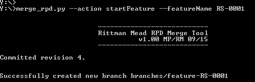
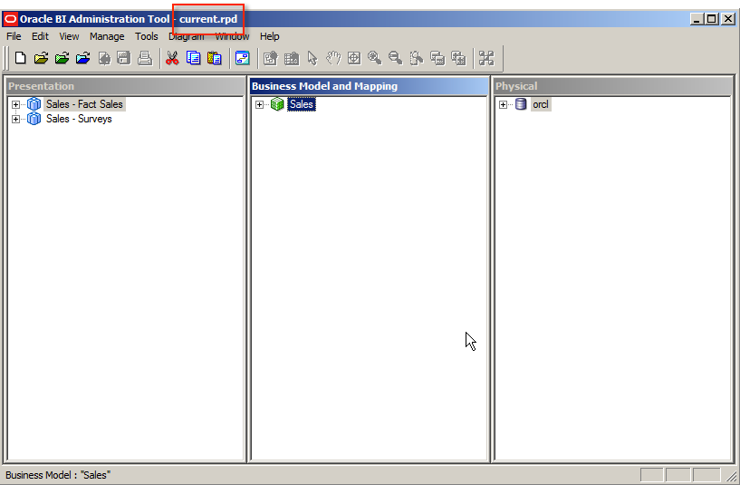
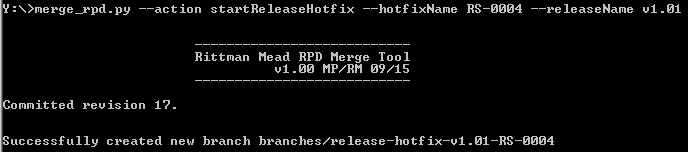
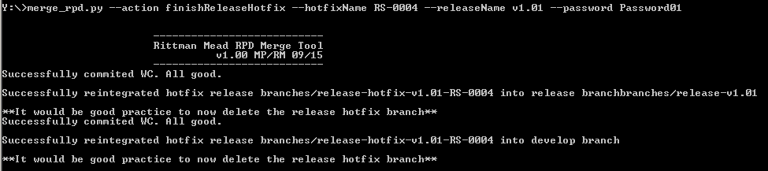

Concurrent OBIEE RPD Development (SVN)
======================================

This project provides the capability for multiple users to develop on the RPD of [OBIEE](http://www.oracle.com/technetwork/middleware/bi-enterprise-edition/overview/index.html) concurrently. Additionally, the RPD is version controlled using this method either using [SVN](https://subversion.apache.org/). This uses the [GitFlow](http://nvie.com/posts/a-successful-git-branching-model/) development methodology and it is recommended that you read that guide to get an idea of the methodology this process uses. The method is far more important than the code or technology behind it. Indeed, it is equivalent to ignore these scripts and perform all of these steps manually, the code here is simply to help to automate and simplify the steps as much as possible.

# Setup

## Pre-requisites

* [Python 2.7](https://www.python.org/)
* [SVN](https://subversion.apache.org/)
* [SVN Command Line](https://www.visualsvn.com/downloads/)
* OBIEE Client Tools
* One of `obi-merge-git.py` or `obi-merge-svn.py`
* Configuration file: `config.ini`

## Configuration

Copy `config.ini.sample` to `config.ini` so that it is readable by the program. Fill in the static configuration for your system so the merge can work seamlessly. The parameters required are described here. Note that whenever paths are specified on Windows you will need to use a double backslash `\\` when specifying path separators. E.g. `C:\\OBIEE.

**[OBIEE]**

* `OBIEE_VERSION`: Either 12 or 11, indicating the major version of OBIEE you are using.
* `CLIENT_ONLY`: Either False or True, indicating whether the machine you are using has a server OBI installation, or just a client installed. *Only required for OBIEE 11g*.
* `OBIEE_HOME`: The full path to the OBIEE server installation on the machine. *Only required for OBIEE 11g*.
* `OBIEE_CLIENT`: The full path to the OBIEE client.
* `RPD_PW`: RPD password, expected not to change and to be the same for all offline RPDs.

### SVN Configuration

**[SVN]**

This section is only required if you're using SVN as your source control mechanism.

* `SVN_BIN`: Full path to the local SVN executable.
* `SVN_BASE_URL`: URL for the SVN repository, e.g. `https://training/svn/OBIEE`
* `SVN_TRUNK`: Name of the SVN trunk which should contain production code. E.g. `trunk` for a full path of `https://training/svn/OBIEE/trunk`.
* `SVN_DEVELOP`: Name of the SVN directory for the development branch, e.g. `branches/develop` for a full path of `https://training/svn/OBIEE/branches/develop`.
* `SVN_DEV_BRANCH_ROOT`: Prefix for the feature branches, e.g. `branches/feature` for a full path of `https://training/svn/OBIEE/branches/feature-F01`.
* `SVN_RELEASE_BRANCH_ROOT`: Prefix for the release branches, e.g. `branches/release` for a full path of `https://training/svn/OBIEE/branches/release-v1.00`.
* `SVN_RELEASE_HF_BRANCH_ROOT`: Prefix for the release hotfix (bugfix) branches, e.g. `branches/release-hotfix` for a full path of `https://training/svn/OBIEE/branches/release-hotfix-v1.00-HF01`.
* `SVN_HF_BRANCH_ROOT`: Prefix for the production hotfix branches, e.g. `branches/hotfix for a full path of `https://training/svn/OBIEE/branches/hotfix-HF01`.

## Conflict Resolution

If there is a Git/SVN merge conflict, the script will attempt an automatic three-way RPD merge using `comparerpd`/`patchrpd` utilities. If this is unsuccessful then the Administration Tool is launched with the 'current' merge candidate loaded and the 'original' and 'modified' merge candiate files renamed to such in the same temporary directory. The user then needs to perform a manual three-way merge, save the resulting RPD using the default filename  (`current(1).rpd`) and then quit the Administration Tool tool. If the script finds the `current(1).rpd` it will assume the merge was successful and commit it automatically. This is used for both source control varieties but it is important to know that any peculiarities with the OBI merge process will be reflected, as will any differences between merge rules on different versions of OBI.

# SVN Methodology

This document explains the use of the `obi-merge-svn.py` script in order to manage concurrent development of the OBIEE Metadata Repository (RPD) using SVN as the source control tool.

This is a process and tool wrapper on top of using a git-flow based method and three-way RPD merge using the OBIEE tools to resolve conflicts when merging branches. This can all be performed manually if required, and it is a good idea if indeed it is done manually at times. The scripts provided are just ways of automating the process to reduce the time spent on it.

It is important to have a nominated "Source Master" with oversight and understanding of both the development tasks being undertaken, and the development method being followed. This is the person who would be responsible for arbitrating merge conflicts and reviewing and mentoring developers in their use of the process.

## Initialisation

1. Commit to `/trunk` the current Production RPD, along with all other artefacts that you want to keep under source control. Where these do not yet exist it is a good idea to create the containing folders anyway. Creating these folders at a later date can cause merge problems.

    

2. Make `develop` branch match `trunk`. Be sure to use the same name as you specify in the **SVN_DEVELOP** configuration parameter above.
    2. If `develop` branch exists already, merge `trunk` into `develop` (eg TortoiseSVN, or command line).

    3. If it doens't exist already then create it by doing a SVN Copy (create branch) from `trunk`.

        

## Principles

0. It is strongly recommended that you remove any **Projects** from the RPD unless you require them to be present. They are known to cause serious complications with the manual merge process (ref. MoS Doc ID 1999105.1)
1. Be meticulous in the use of feature branches. Anything that can go through from dev to release on its own without dependency on another code item is its own feature
    2. It is really easy, but very wrong, to just have a generic "Fred's development branch". Avoid this at all costs
2. Split JIRA tasks into subtasks as necessary to define features, and use the JIRA [sub-]task as the branch name
3. Commit your changes to your feature branch regularly
    1. Helpful for you as a developer to be able to roll back changes made
    2. Important from SVN point of view to have an accurate history of changes
4. Always use the SVN **merge reintegrate** option
5. Delete feature branches once merged into develop; leaving them around just makes things messy
6. In between commencing a merge and committing back to SVN, do not make any changes to the objects other than that necessary for the valid merge.
7. At any time, the user can opt to do a manual merge of the RPD. There is no magic other than the automation of the 3-way merge when there are no conflicts raised by the Administration Tool.
8. You can have multiple SVN working copies on your local machine. If you're actively working on multiple features concurrently then this makes sense. However it is a bad idea to have lots of working copies of stale branches (those which have since been reintegrated to develop/trunk).

## Development

Development is done using the following process:

1. **Start** a feature, using `obi-merge-svn.py`. This creates in SVN a branch from develop  that will be used solely for work on this feature.
    2. A feature is a discrete task that could (theoretically) be promoted to Production with no dependencies on other code changes. One JIRA task should exist for each feature, and it is a good idea to name features based on the JIRA ticket number
2. Using TortoiseSVN (or other tool) checkout the new feature branch to your local machine. This local folder is known as the **Working Copy** and represents the code state *in the current feature branch*.
3. Make your development changes to the RPD file from the Working Copy. It is a good idea to save it and commit back to SVN with descriptive commit messages frequently so that the branch contains a clear history of work undertaken.
4. Once the feature is complete and unit testing successfully completed, commit the RPD and any other related objects (such as .catalog exports of related Presentation Catalog content) from the working copy to your feature branch
5. **Finish** the feature, using `obi-merge-svn.py`. This does a SVN "reintegrate merge" of the feature branch back into the develop branch.
    6. Good practice is to then *delete* the feature branch from within SVN as well as your local working copy of it. The avoids mistakenly carrying out further development branch on a defunct branch when a new feature branch should actually be started.

### Starting a Feature

1. Call `obi-merge-svn.py` specifying **startFeature** and the **featureName**:

        obi-merge-svn.py --action startFeature --featureName RS-0001

    

    This creates the feature branch in SVN.

2. Checkout the new feature branch to your local machine

    

### Developing another Feature Concurrently

1. **Start** a second feature branch. This will be based on **develop** and not have any of the first feature branch's content

        obi-merge-svn.py --action startFeature --featureName RS-0002

2. Checkout the new feature branch to your local machine, in a different working copy folder than the first.

Now changes can be made on both feature RS-0001 and RS-0002, with no dependency on the other.

### Finishing a Feature - Clean Merge

1. Make sure that you've saved your RPD in the correct working copy for the feature that you're working on.
2. Commit the changed file(s).

    

3. Run `obi-merge-svn.py` with **finishFeature**. This merges the feature branch back into develop. If nothing else has changed on develop since the feature branch was created, the merge will complete cleanly. It is important to specify the RPD password in case an RPD merge is required.

        obi-merge-svn.py --action finishFeature --featureName RS-0001 --password Password01

    

### Finishing a Feature - Automatic RPD Merge

Where changes are made to the develop branch (through other features being completed, or hotfixes being applied back from Production) since a feature branch is started, SVN with throw a merge conflict since the RPD file is a binary object that SVN cannot parse. The `obi-merge-svn.py` will detect this conflict and attempt an automatic merge using the OBIEE tools.

1. Run `obi-merge-svn.py` with **finishFeature**. This merges the feature branch back into develop. It is important to specify the RPD password so that the RPD merge can be automatically attempted when the conflict arises.

        obi-merge-svn.py --action finishFeature --featureName RS-0002 --password Password01

    

### Finishing a Feature - Conflicting RPD Merge

When a merge conflict is encountered in SVN, a three-way RPD merge is attempted by `obi-merge-svn.py`. However if the same objects have changed in both branches then an RPD merge conflict is encountered and manual intervention is necessary. This could be an object in the RPD being deleted in one branch and updated in another, or the same object being modified in different ways in both branches.

1. **Finish** the feature as normal:

        obi-merge-svn.py --action finishFeature --featureName RS-0003 --password Password01

2. The script will attempt a three-way merge but not be able to do so. You are then prompted to press enter, at which point the Administration Tool will be opened automatically for you with the "**current**" merge candidate loaded:

    
    

3. In the Administration Tool go to **File** -> **Merge** and select the "**original**" and "**modified**" RPD files from the same temporary folder as the current one - the Administration Tool will default to this. The important step here is that you just load the files literally named "original.rpd" and "modified.rpd" -- you don't try to use any others.

    
    
    

4. For all the merge conflicts, resolve them with the appropriate choice. This is where the *Source Master* role is important as they should have an understanding of what changes have been made and why, and what the best resolution of a conflict would be.

    The "modified" RPD represents what is currently on the develop branch; "current" is the feature branch being merged back in to develop.

    

5. Once all conflicts have been resolved, click **Save** and then **Close the Administration Tool** (do not minise it; quit it completely). The `obi-merge-svn.py` script will detect that the merge was competed and successfully based on the presence of the `current(1).rpd` file (which is what the RPD is saved as by default when you press Save), and complete the SVN merge commit:

    

If you cannot immediately resolve the RPD merge, do not save the RPD. This will cause the `obi-merge-svn.py` script to abort. You can then rerun the script at a later date to trigger the same merge process, or perform it entirely manually.

### Refreshing a Feature Branch from Develop

In order to minimise merge conflicts when a feature has been finished and is to be merged back into develop, it is a very good idea to update feature branches with any changes that have been merged into develop. If features "X" and "Y" are finished and merged back into develop, refreshing feature branch "Z" with these will make merging feature "Z" back into develop easier when it is ready, because the nett difference between Z and develop will be just the development made to Z, rather than X, Y, and Z. An additional benefit of this approach is that any conflicting changes can be addressed by the feature developer in isolation, rather than at the point of merge back into develop.

1. Run `obi-merge-svn.py` with the **refreshFeature** option, and specify the **featureName**. Any conflicts will be resolved automatically where possible, or the Administration Tool launched for manual intervention if required.

        obi-merge-svn.py --action refreshFeature --featureName RS-0003 --password Password01

    

## Release Process

Once one or more features have been finished and merged into develop, a release can be created. A release is a collection of one or more features that are to be promoted through the test environments prior to a Production deployment. A release may identified by an incrementing version number (v1.00, v1.01, etc), a JIRA ticket, or any other sensible label. There can be multiple concurrent release branches, but only one should be deployed in a test environment at a given time, and only one should be deployed to Production in a given window. If multiple releases end up being required for deployment together then by definition that is a single release.

### Preparing a release

1. Use the `obi-merge-svn.py` script to create a release branch from develop as it currently stands.

        obi-merge-svn.py --action startRelease --releaseName v1.00

    

    _If you want to branch from develop at another point in the revision, or do a "cherry pick" release you would need to prepare this yourself._

This creates a branch of code that can be deployed into UAT, QA etc for testing:

### Release to Production

If no issues are found during testing then the release branch is merged it into Trunk, denoting that it is ready for release to Production

1. Use the `obi-merge-svn.py` script to **finishRelease**:

        obi-merge-svn.py --action finishRelease --releaseName v1.00 --password Password01

    `--password` is the RPD password in case merge conflicts are encountered.

    

### Fixing Issues Encountered in Release Testing

If an issue is found during the testing of a release branch then it should be logged in JIRA and a **release hotfix** of the same name as the JIRA ticket created. Make sure there is one ticket/hotfix **per issue identified**.

1. Use the `obi-merge-svn.py` script to create a release hotfix branch from the current release branch. You need to specify the `--releaseName` as well as a `--hotfixName`.

        obi-merge-svn.py --action startReleaseHotfix --hotfixName RS-0004 --releaseName v1.01

    

2. Checkout the release hotfix branch to your local machine

    

3. Fix the issue that has been identified.
    

4. When you have finished the fix, use the **finishReleaseHotfix** action in the `obi-merge-svn.py` script. This will merge the hotfix back into the correct release branch, and also merge the fix back into develop to ensure that it propogates through future code line.

    

Release Hotfixes can be created, developed and merged back concurrently. The `obi-merge-svn.py` script will correctly manage merge conflicts when they arise. If an unresolvable RPD merge conflict is found then the same method described above using the manual Administration Tool merge should be followed.

## Production Hotfixes

When an issue is identified in Production and must be fixed before the next scheduled Release then a Hotfix can be created. This is based on the current Production (trunk) code.

1. Run `obi-merge-svn.py` and specify **startHotfix** and the **hotfixName**:

        obi-merge-svn.py --action startHotfix --hotfixName RS-0005

    

2. Checkout the hotfix branch to your local machine

3. Fix the issue that has been identified.

4. When you have finished the fix, use the **finishHotfix** action in the `obi-merge-svn.py` script. This will merge the hotfix back into **trunk**, and also merge the fix back into **develop** to ensure that it propogates through future code line.

    

    If a merge conflict arises (for example, if a release has taken place whilst the hotfix was being created) the script will perform an automatic three-way merge of the RPD.

# Appendix (SVN)

## commitMessage

Add the `--commitMessage` to any invocation of `obi-merge-svn.py` to define the commit message used for SVN. If not present the tool will try to generate a commit message automatically based on the assumed-JIRA reference present in the feature/release/hotfix name.

Enclose the message in quotes:

    --commitMessage "FOO-1234: Add wibble logical table source to the foobar"

## startFeature

    obi-merge-svn.py --action startFeature --featureName RS-0002

Creates a feature branch, named using **featureName** and the configuration parameter values:

    <SVN_TRUNK>/<SVN_DEV_BRANCH_ROOT>-<featureName>

## startRelease

    obi-merge-svn.py --action startRelease --releaseName v1.00

Creates a release branch from the current develop branch, named using **releaseName** and the  configuration parameter values:

    <SVN_TRUNK>/<SVN_RELEASE_BRANCH_ROOT>-<releaseName>

## startReleaseHotfix

    obi-merge-svn.py --action startReleaseHotfix --hotfixName RS-0004 --releaseName v1.01

Create a Release Hotfix branch from the release branch specified by **releaseName**, named using **hotfixName**, **releaseName**, and the configuration parameter values:

    <SVN_TRUNK>/<SVN_RELEASE_HF_BRANCH_ROOT>-<releaseName>-<hotfixName>

## startHotfix

    obi-merge-svn.py --action startHotfix --hotfixName RS-0005

Creates a Hotfix branch based on the current trunk code, named using **hotfixName** and the configuration parameter values:

    <SVN_TRUNK>/<SVN_HF_BRANCH_ROOT>-<hotfixName>

## finishFeature

    obi-merge-svn.py --action finishFeature --featureName RS-0002 --password Password01

Merges Feature branch **featureName** back into develop.

Merge conflicts are managed per the description in Appendix A. The password for the RPD must be specified with **password**, whether a merge confict is expected or not.

## finishRelease

    obi-merge-svn.py --action finishRelease --releaseName v1.00 --password Password01

Merges the Release branch **releaseName** back into trunk.

Merge conflicts are managed per the description in Appendix A. The password for the RPD must be specified with **password**, whether a merge confict is expected or not.

## finishReleaseHotfix

    obi-merge-svn.py --action finishReleaseHotfix --hotfixName RS-0004 --releaseName v1.01 --password Password01

Merges the Release Hotfix branch **releaseName**-**hotfixName** into the release branch **releaseName**, and also to develop.

Merge conflicts are managed per the description in Appendix A. The password for the RPD must be specified with **password**, whether a merge confict is expected or not.

## finishHotfix

    obi-merge-svn.py --action finishHotfix --hotfixName RS-0005 --password Password01

Merges the Hotfix branch **hotfixName** into **trunk** and **develop**.

Merge conflicts are managed per the description in Appendix A. The password for the RPD must be specified with **password**, whether a merge confict is expected or not.

## refreshFeature

    obi-merge-svn.py --action refreshFeature --featureName RS-0003 --password Password01

Merges the develop branch into Feature branch **featureName**.

Merge conflicts are managed per the description in Appendix A. The password for the RPD must be specified with **password**, whether a merge confict is expected or not.

## standaloneRPDMerge

    obi-merge-svn.py --action standaloneRPDMerge --original A.rpd --current B.rpd --modified C.rpd --password Password01 --output D.rpd

Attempts to perform an automatic three-way RPD merge per the description in Appendix A, writing the resulting RPD to `output.rpd` or as specified by **output**. Requires all files to be local. Does not take any SVN action.

## reintegrate

    obi-merge-svn.py --action reintegrate --source_url https://training/svn/OBIEE/branches/develop --target_url https://training/svn/OBIEE/branches/release-v1.00 --password Password01

Perform a SVN merge reintegrate (as is used on all the above _finish_ actions) from the specified **source_url** to the **target_url**.

This is useful in complex scenarios where the provided start/finish branching actions do not meet a particular requirement. It should not need to be used routinely.

Merge conflicts are managed per the description in Appendix A. The password for the RPD must be specified with **password**, whether a merge confict is expected or not.

