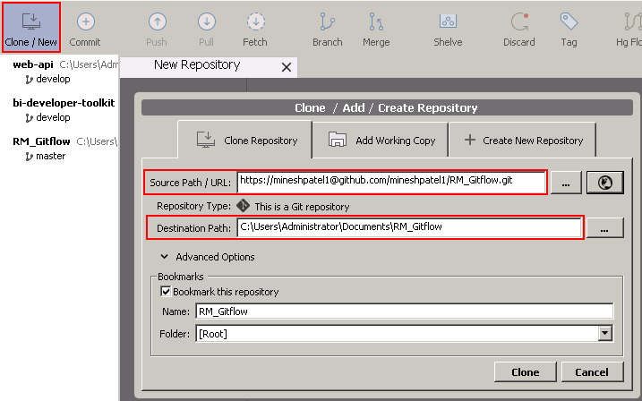
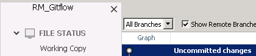
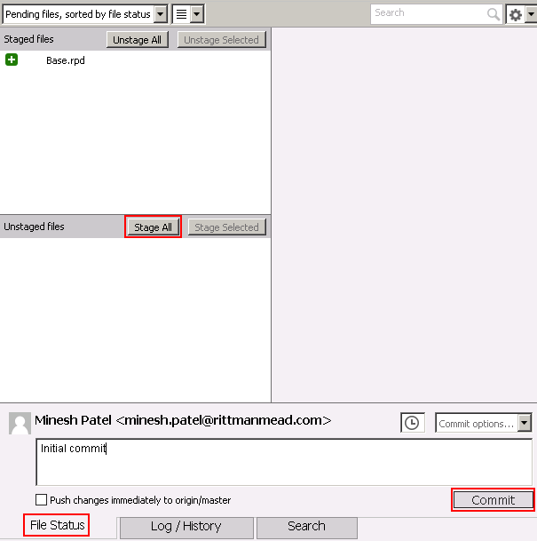
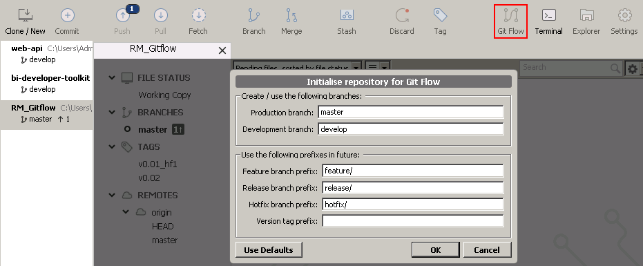
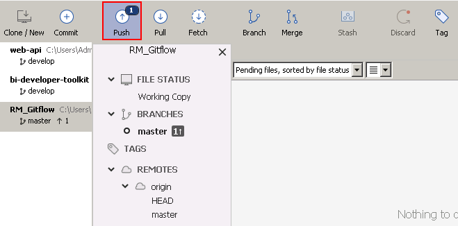
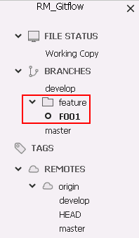
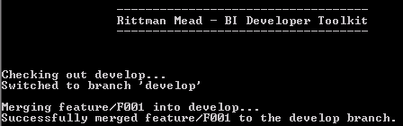
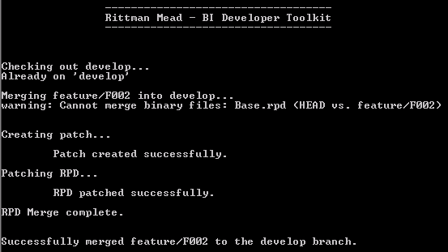
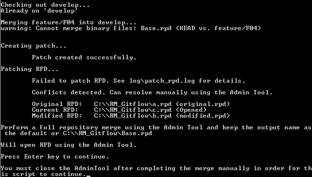
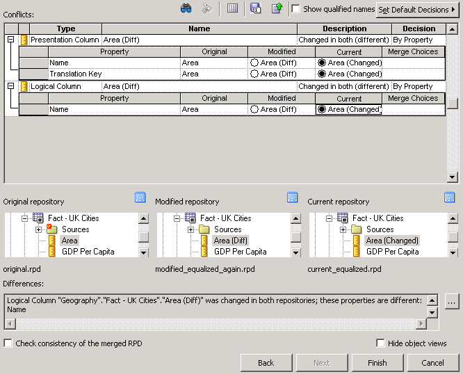

Concurrent OBIEE RPD Development (Git)
======================================

This project provides the capability for multiple users to develop on the RPD of [OBIEE](http://www.oracle.com/technetwork/middleware/bi-enterprise-edition/overview/index.html) concurrently. Additionally, the RPD is version controlled using this method either using [Git](https://git-scm.com/). This uses the [GitFlow](http://nvie.com/posts/a-successful-git-branching-model/) development methodology and it is recommended that you read that guide to get an idea of the methodology this process uses. The method is far more important than the code or technology behind it. Indeed, it is equivalent to ignore these scripts and perform all of these steps manually, the code here is simply to help to automate and simplify the steps as much as possible.

# Setup

## Pre-requisites

* [Python 2.7](https://www.python.org/)
* [Git](https://git-scm.com/)
* [Atlassian SourceTree](https://www.sourcetreeapp.com/) - GUI tool for Git
* OBIEE Client Tools
* One of `obi-merge-git.py` or `obi-merge-svn.py`
* Configuration file: `config.ini`

## Configuration

Copy `config.ini.sample` to `config.ini` so that it is readable by the program. Fill in the static configuration for your system so the merge can work seamlessly. The parameters required are described here. Note that whenever paths are specified on Windows you will need to use a double backslash `\\` when specifying path separators. E.g. `C:\\OBIEE.

**[OBIEE]**

* `OBIEE_VERSION`: Either 12 or 11, indicating the major version of OBIEE you are using.
* `CLIENT_ONLY`: Either False or True, indicating whether the machine you are using has a server OBI installation, or just a client installed. *Only required for OBIEE 11g*.
* `OBIEE_HOME`: The full path to the OBIEE server installation on the machine. *Only required for OBIEE 11g*.
* `OBIEE_CLIENT`: The full path to the OBIEE client.
* `RPD_PW`: RPD password, expected not to change and to be the same for all offline RPDs.

### Git Configuration

**[Git]**

This section is only required if you're using Git as your source control mechanism.

* `GIT_EXE`: Full path to the local Git executable.
* `GIT_REPO`: Full path to the source controlled directory with the OBIEE RPD to use with the tool.
* `GIT_RPD`: Name of the RPD in the repository to version control and track for changes.
* `GIT_REMOTE`: Name of the remote Git repository (usually `origin`).
* `GIT_DEVELOP`: Name of the development branch) as per the GitFlow methodology.
* `GIT_MASTER`: Name of the production branch as per the GitFlow methodology.
* `FEATURE_PREFIX` : Prefix for GitFlow features, e.g. `feature/` for branch `feature/01`
* `RELEASE_PREFIX` : Prefix for GitFlow releases, e.g. `release/` for branch `release/v1.0`
* `HOTFIX_PREFIX` : Prefix for GitFlow hotfixes, e.g. `hotfix/` for branch `hotfix/v1.0 HF1`

## Conflict Resolution

If there is a Git/SVN merge conflict, the script will attempt an automatic three-way RPD merge using `comparerpd`/`patchrpd` utilities. If this is unsuccessful then the Administration Tool is launched with the 'current' merge candidate loaded and the 'original' and 'modified' merge candiate files renamed to such in the same temporary directory. The user then needs to perform a manual three-way merge, save the resulting RPD using the default filename  (`current(1).rpd`) and then quit the Administration Tool tool. If the script finds the `current(1).rpd` it will assume the merge was successful and commit it automatically. This is used for both source control varieties but it is important to know that any peculiarities with the OBI merge process will be reflected, as will any differences between merge rules on different versions of OBI.

# Git Methodology

This explains usage with Git as the source control mechanism. This is very similar for SVN, but that is described in the later sections of this document.

## Principles

It is strongly recommended that you remove any **Projects** from the RPD unless you absolutely require them to be present. They are known to cause serious complications with the manual merge process (ref. Oracle Support Doc ID 1999105.1).

Be meticulous in the use of feature branches. Anything that can go from dev to release on its own without dependency on another code item is its own feature. Managing these features well and splitting development appropriately is **essential** to a reliable development strategy. It is very easy, but very wrong, to have a generic "Fred's development branch". Avoid this at all costs.

If using JIRA (or any other management tool), name features accordingly. Similarly, note that you can use [Git Issues](https://guides.github.com/features/issues/) to manage granular issues if necessary, and these can be tied to specific [commits](https://help.github.com/articles/closing-issues-via-commit-messages/).

Commit changes to your local feature branch regularly. This will allow you to roll back changes as and when you need to and is important for the project as a whole to keep a full history of changes.

In between commencing a merge and committing back to Git, do not make any changes to the objects other than that necessary for the valid merge.

At any time, the user can opt to do a manual merge of the RPD. There is no magic other than the automation of the standard OBIEE 3-way merge when there are no conflicts raised by the Administration Tool.

## Initialisation

An empty, remote Git repository should have been setup for the project. For this tutorial, this repository will be called `RM_Gitflow.git` and is hosted on GitHub.

### Clone Repository

Firstly, clone the repository from using the SourceTree application:



In the **Clone Repository** tab, enter the URL for the remote git repository for *Source Path*. For *Destination Path*, enter a local location to store the clone. This needs to be an accessible and empty directory on the local machine, e.g. `C:\Gitflow`. This will clone the repository, copying all contents down to the local machine from the server. The **master** branch should be the one checked out. You can identify this from the SourceTree GUI under *Branches*. Since this project is blank, you will only have a `.git` folder which contains all of the metadata about the Git repository.

### Initial Commit

The next step is to make the first commit, committing the RPD to be source controlled. Copy the base RPD into the local Git repository. Now when looking back in SourceTree you can see that there are uncommitted changes.



Click on **Working Copy** (or the **File Status** tab) to see the changes that have been made. There should be one new file (denoted by a ?). Click the **Stage All** button and the file will move to the staged area in the top pane.



Type a comment for the commit, e.g. `Initial commit` and click the **Commit** button to confirm the changes.

### Initialising Git Flow

SourceTree is a good app for this style of development as it has an in-built Git Flow system for managing branches. The script provided with the toolkit will automate much of this, but it can still be handy when making manual changes.



Click the Git Flow button in the top right and it will open the dialogue above. This allows you to set the prefixes for development. These should match the `PREFIX` parameters configured in [`config.ini`](#configuration-parameters). This step will checkout the `develop` branch of the repository (or create it if not already existing).

### Pushing and Pulling Changes

The changes made are only local at this stage so we need to **Push** them back to the remote repository. There's a button in the task bar for this. By default, the remote repository is named `origin`. SourceTree shows a list of the remote repositories linked to your local in the left panel.



This action uploads your changes so that other users can retrieve them by **Pulling** them from the repository. You should **always** pull changes before creating a feature or making any changes. You will be forced to pull changes when trying to merge or push changes back to the remote repository.

In order to see if there are any outstanding changes to the repository, you can click the **Fetch** button as seen above. This will then highlight the **Pull** button with the number of commits required for synchronisation.

## Git Flow Development

The Git Flow methodology states that tasks should be divided into features. These can then be developed individually and then merged back into the development branch. This is performed for the RPD using the Admin Tool 3-way merge. This section explains each of the tasks involved in this process.

### Starting a Feature

This creates a *new feature* branch from the **develop** branch. Specifically that means creating a starting point from the existing development trunk. Call the merge script specifying `startFeature` and the feature name, e.g. `F01`

```bash
python obi-merge-git.py startFeature F01
```

This should create a new branch (as well as check it out), which can be seen in SourceTree:



At this point you can begin developing the RPD and make whichever changes are required. All of these changes should be committed and it does not matter how many commits you make for a given feature, which should encourage regular committing.

### Starting a Second Concurrent Feature

Another user can begin a second feature (F02), which will also be started at the *same* **develop** commit as the first user when they began F01. This is important as it allows the three-way merge resolution to use the correct original RPD. If you are testing this on a single machine, you can just begin the new feature (the process is identical, but you won't need to push/pull changes from the remote repository).

```bash
python obi-merge-git.py startFeature F02
```

The second feature, F02 contains changes to *different* objects than those altered in F01.

### Finishing a Feature - Clean

Make sure all changes have been committed: SourceTree should display *Nothing to Commit* on the File Status screen. Now execute the merge script passing `finishFeature` as an argument. The feature name also needs to be provided.

```bash
python obi-merge-git.py finishFeature F01
```



As this is the first feature committed to the develop branch, there will be no issue in merging back. The original feature branch will be deleted, but the develop branch will now contain the new commit.

### Finishing a Feature - Automatic RPD Merge

If we attempted to merge back F02 to the develop branch now, Git would throw an error. This is because `develop` has changed from the starting point of F02 but it cannot resolve those changes because the RPD is a binary file. Instead, we use the OBIEE Admin tool to resolve these changes using a three way merge. In this case, F01 and F02 have no conflicting changes and so an automatic three way merge is possible.

```bash
python obi-merge-git.py finishFeature F02
```



The RPD merge is done using the BI Toolkit script `rm_sys.three_way_merge` which in turn uses the OBIEE client to create an XML diff patch between the *Current* and *Original* RPDs and applies it in a merge of the *Modified* and *Original* RPDs.

### Finishing a Feature - Conflicting RPD Merge

When Git detects a merge conflict (whenever the RPDs have changed), a three way merge will be attempted using the OBIEE client. However, sometimes the OBIEE cannot resolve this either due to shared objects being changed or deleted. To test this, create two new features F03 and F04 which modify the *same* specific object in the RPD. Commit the changes and attempt to finish the features.

```bash
python obi-merge-git.py finishFeature F03
```

The first feature, F03 will finish successfully and merge to `develop`. This is because it is the first change to `develop` in this development cycle.

```bash
python obi-merge-git.py finishFeature F04
```

When merging the second feature, the script will once again attempt to automatically three way merge the RPDs using the OBIEE client. However, this will fail due to the detection of conflicts. Additionally the RPD will be opened, prompting the user to manually complete the three way merge using the Admin Tool.



The merge can be completed by going to **File > Merge..** and selecting `original.rpd` and `modified.rpd` for the Original and Modified options respectively. Optionally you can choose to equalise objects during the merge. Unlike the command line script, the Admin Tool will graphically prompt the user with conflict resolution options.



## Refreshing a Feature from Develop

In order to minimise merge conflicts when a feature has been finished and is to be merged back into develop, it is a very good idea to update feature branches with any changes that have been merged into develop. If features "X" and "Y" are finished and merged back into develop, refreshing feature branch "Z" with these will make merging feature "Z" back into develop easier when it is ready, because the nett difference between Z and develop will be just the development made to Z, rather than X, Y, and Z. An additional benefit of this approach is that any conflicting changes can be addressed by the feature developer in isolation, rather than at the point of merge back into develop.

Run the merge script passing `refreshFeature` as an argument and specify the feature name. This will trigger the Git BI merge process but in reverse from `finishFeature`. Specifically, that is merging changes from develop into your current feature.

```bash
python obi-merge-git.py refreshFeature F08
```

This will go through the same OBIEE three way merge and conflict resolution as before if necessary. Note that it is typical to see a warning of `There is no tracking information for...`, which indicates that the feature has not been pushed to the remote. It is normal to keep feature changes local until pushing to develop and so this error can be ignored.

# Git Flow Releases and Hotfixes

Releases work in a similar way to features, but instead attempt to merge the **develop** branch with the **master**.

## Starting a Release

Run the merge script specifying `startRelease` as the first argument and then the release name (usually a version number).

```bash
python obi-merge-git.py startRelease v1.00
```

This will create a new release branch from the latest **develop** commit. During this time, changes can be made to the release branch which will then be merged back into **develop** upon completion.

## Bufixes

You may find bugs in the release branch and want to merge bugfixes made in that branch back into development. This action merges a release branch back into development without deleting the release branch. You need to specify the **release** branch you wish to merge back.

```bash
python obi-merge-git.py bugfix v1.00
```

## Finishing a Release

```bash
python obi-merge-git.py finishRelease v1.00
```

Finishing a release will merge the release branch into *both* the **develop** and **master** branches. The merge process is the standard three way merge and conflict resolution that has been described for features. Additionally, a tag will be created for this commit with the release name. A custom name for the tag can be specified using the `-t` argument.

## Starting a Hotfix

A **hotfix** in Git Flow is a branch which begins at the latest **master** commit. Development is then done on this branch until completion at which time it is merged back into the **develop** *and* **master** branches.

Run the merge script specifying `startHotfix` as the first argument and then the hotfix name (usually a version number).

```bash
python obi-merge-git.py startHotfix "v1.00-HF1"
```

This creates a branch from the **master** commit and development can begin.

## Finishing a Hotfix

Once work on the hotfix has completed, the merge script can be used to merge it back into the trunks:

```bash
python obi-merge-git.py finishHotfix "v1.00-HF1"
```

Similarly to a release, it will merge into **master** and **develop** as well as creating a tag for that commit.

# Appendix (Git)

## Options

The script has a number of options that can be passed as arguments:

* `-p`, `--push`: Automatically pushes the relevant trunk to the when finishing features, hotfixes and releases.
* `-a`, `--autoOpen`: Opens the RPD in the Admin Tool after performing a 3 way merge, so it can be checked by the developer.
* `-t`, `--tag`: Specify a tag name for releases and hotfixes. Otherwise uses the branch name.
* `-c`, `--config`: Specify a custom `.ini` file from the `bi-developer-toolkit` directory.
* `-d`, `--debug`: Enables debugging mode for more verbose log messages.

## Command Reference

### Start Feature

```bash
obi-merge-git.py startFeature <Feature-Name>
```

### Finish Feature

```bash
obi-merge-git.py finishFeature <Feature-Name>
```

### Refresh Feature

```bash
obi-merge-git.py refreshFeature <Feature-Name>
```


### Start Release

```bash
obi-merge-git.py startRelease <Release-Name>
```

### Bugfix (Release back to Development)

```bash
obi-merge-git.py bugfix <Release-Name>
```

### Finish Release

```bash
obi-merge-git.py finishRelease <Release-Name>
```

### Start Hotfix

```bash
obi-merge-git.py startHotfix <Hotfix-Name>
```

### Finish Hotfix

```bash
obi-merge-git.py finishHotfix <Hotfix-Name>
```

